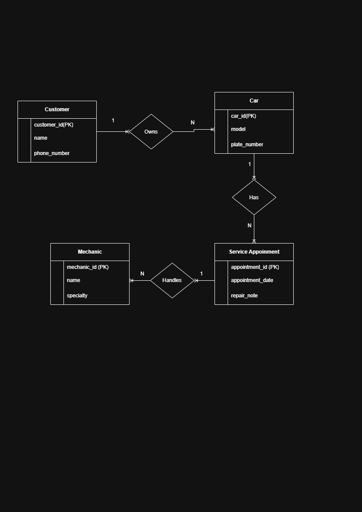

# INFOMAN1 – Week 2 Lab: Conceptual ERD Case Study
**Name:** [CORALES JERIE]
**Student ID:** [2510704]
**Section:** [CCSE]

## Task 1: Candidate Entities and Justification

### 1. Customer
A customer is an entity because the repair shop serves different customers. Each customer may bring one or more cars for repair.

### 2. Car
A car is an entity because the shop records information about each vehicle, such as its model, plate number, and color. Each car belongs to one customer.

### 3. Mechanic
A mechanic is an entity because the shop employs mechanics who perform repair services. Each mechanic has a name and specialty.

### 4. Service Appointment
A service appointment is an entity because it records scheduled services for cars. It includes the appointment date, repair notes, and the mechanic assigned to the service.

## Task 2: Attributes and Domains

### 1. Customer
- **customer_id (PK):** Integer
- **name:** Text
- **phone_number:** Text
- **Domains:** Integer, Text

### 2. Car
- **car_id (PK):** Integer
- **model:** Text
- **plate_number:** Text
- **color:** Text
- **Domains:** Integer, Text

### 3. Mechanic
- **mechanic_id (PK):** Integer
- **name:** Text
- **specialty:** Text
- **Domains:** Integer, Text

### 4. Service Appointment
- **appointment_id (PK):** Integer
- **appointment_date:** Date
- **repair_note:** Text
- **Domains:** Integer, Date, Text

## Task 3: Relationships and Cardinality

### 1. Customer owns Car
- **Relationship:** Owns
- **Cardinality:** One-to-Many (1:N)
- One customer can own many cars.
- Each car belongs to exactly one customer.

### 2. Car has Service Appointment
- **Relationship:** Has
- **Cardinality:** One-to-Many (1:N)
- One car can have many service appointments.
- Each appointment is for one car.

### 3. Mechanic handles Service Appointment
- **Relationship:** Handles
- **Cardinality:** One-to-Many (1:N)
- One mechanic can handle many service appointments.
- Each appointment is handled by one mechanic.

The Service Appointment entity connects the Car and Mechanic entities. This allows one car to be serviced by different mechanics during different visits.

## Task 4: Conceptual ERD

